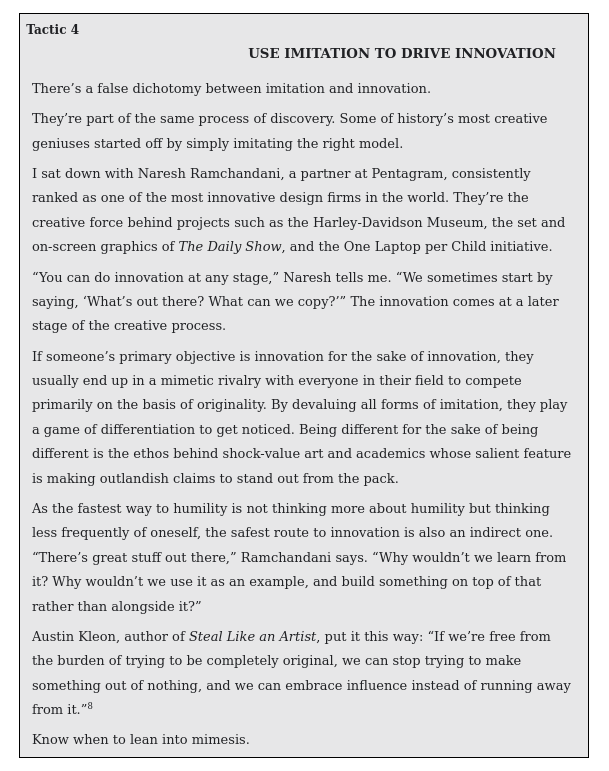
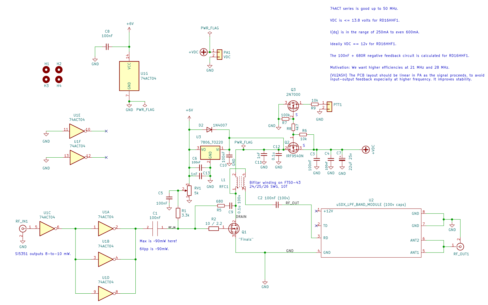
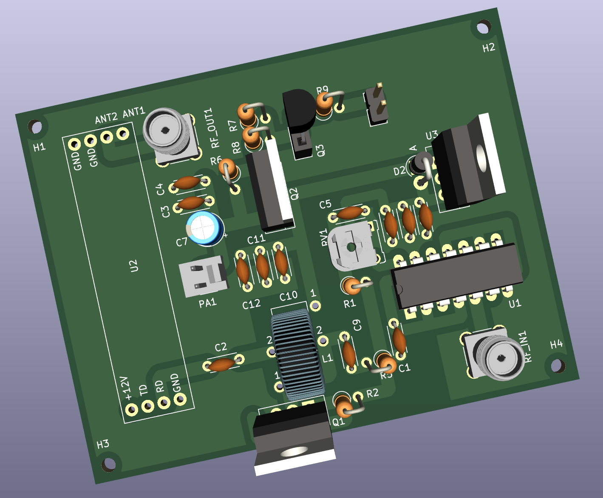
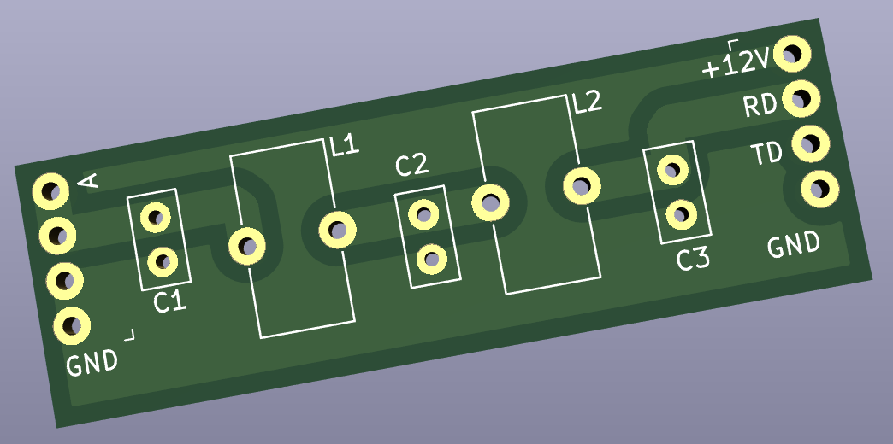

### HF-PA-v3

VU3CER's Robust `Class-C / Class-D HF PA` for https://github.com/kholia/Easy-Digital-Beacons-v1
project for 40-20-17-15-12-10m bands - powered by RD16HHF1 RF MOSFET.

This design aspires to be the standard mW-to-QRP-Gallon HF PA in the ~1100 INR
(15 USD) design space.

If you are looking for a ~600 INR IRF510 design, please check out the
https://github.com/kholia/HF-PA-v5 project.

Design Constraints:

- PCB is to be homebrewed.

- PCB is single-sided - only one layer (side) is available for routing work.

- The "finals" MOSFET needs to be on an edge to allow usage of heatsinks.

- Typical external linears (e.g. `PA150 HF Linear Amp`) need 2W minimum to
  function. So we need a minimum of 2W of RF output from our design - even at
  28 MHz (10m).

- Minimal part count is strongly preferred. Low cost, and ease of availability
  are strong driving and deciding factors.

- Reproducibility is a MUST! We focus a lot on this aspect by documenting each,
  and every detail possible.

- Repairability in the field is a MUST!

  Dhiru's finding: Repairing homebrewed PCBs is so much easier, and fun than
  reworking commercial `lead-free` PTH PCBs.

- No moving mechanical parts are allowed in the design - this rules out usage
  of (failure-prone) active cooling options like fans.

Input: Few milliwatts is fine. Note: Si5351's output is around 8-10mW.

Output: To be done.

Robustness check: The PA works fine with 100% duty cycle for more than 8 hours!
In real-life, WSPR defaults to using ~2-minute TX intervals every 10 minutes.
FT8 is naturally gapped every ~15 seconds, and so on. We have also run FT8 on
this HF PA for more than a day at a time. The whole `HF PA v3` system is
thermally super stable.

Note 1: The output power is software controllable (via `PWM grounding`) for
flexibility.

Note 2: The idea behind making these (and my other) design notes publicly
available is to deliver REPRODUCIBLE, flexible, home-brewable, standardized,
reasonable, and cost-effective solutions for some common problems. I include
many references, simulations, and notes in my projects to enable you to do your
own (better) designs - do share them ;)

(Image Credit: `Wanting` book by Luke Burgis)

Note 3: All screenshots are clickable and zoomable.

Please see the older https://github.com/kholia/HF-PA-v2 project for the
power-supply (over-current protected)i design.

Schematic:

PCB rendering:

LPF rendering:

#### PA tuning process

- Remove the MOSFET from the TO-220 socket.

- Set the gate bias to a minimum (~0v).

- Enable PTT.

- Increase gate bias so that Idq (drain current) is in the range of 250mA to
  600mA for RD16HHF1.

- Turn off PTT.

- Connect the RD16HHF1 MOSFET back, enable PTT, enable RF input, and measure RF
  output.

Reference: http://www.carnut.info/WSPR_Tx/WSPR_Tx.htm

#### PA BOM

- 1 x SN74ACT04N (TI) - 65 INR

- 1 x RD16HHF1 - ~500 INR

  - Beware of fakes. Ensure proper sourcing (trusted supply chain, etc) to get
    genuine parts.

- 1 x IRF4905 OR IRF9540 P-Channel TO-220 MOSFET - 50 INR

- 5k Preset (Potentiometer) RM-065 - 15 to 20 INR

- 4 x 10k Ohm - 0.25W Metal Film Resistor - 10 INR

- 1 x 100k Ohm - 0.25W Metal Film Resistor - 5 INR

- 1 x 10 Ohm - 0.25W Metal Film Resistor - 5 INR

- 1 x 3.3k Ohm - 0.25W Metal Film Resistor - 5 INR

- 1 x 4.7k Ohm - 0.25W Metal Film Resistor - 5 INR

- A very large heat sink - 50 to 200 INR - larger heatsink is better!

- 1 x 7806 (TO-220 package from CDIL / ST) Voltage Regulator - 20 INR

- 2 x SMA connectors (PCB mount) - 50 INR

- 1 x 2N7000 TO-92 MOSFET - 10 INR

- 5 x 100nF (104) 50v Ceramic Capacitor - 15 INR

- 2 x 100nF (104) 100v Ceramic Capacitor - 15 INR

- 1 x 22uF 25v Electrolytic Capacitor - 5 INR

- 1 x FT50-43 (Black Toroid) - <= 30 INR

  Note: A bigger "FT68-43" toroid might be better at higher power levels.

- Misc: Relimate Connectors, Copper Clad PCB, Various Consumables (~100 INR)

- Tools: LCR-T4 Meter (for measuring things), RF Power Meter

- PA Total Cost: ~1100 INR

#### Power Supply BOM

See https://github.com/kholia/HF-PA-v2.

#### BOM + Equipment Sources

- https://www.semikart.com/ (IRF510, NP0 LPF caps - Kemet and others)

  - Multicomp Pro 100v C0G caps from Element14 are recommended

- https://www.semikart.com/search/SN74ACT04N

- https://www.electronicscomp.com/

  - IRF510 (Vishay), regular caps, ST voltage regulators

- https://www.electroncomponents.com/ (transistors, connectors, consumables, misc)

- https://www.sunrom.com/ (regular ceramic caps, SMA connectors, SIP socket strip)

- https://projectpoint.in/

  - Transistors, regular caps, voltage regulators, pots / trimmers, MFR resistors, misc

  - 2-Pin High Quality Relimate Connectors (all those 2-pin headers are actually Relimate Connectors)

  - Copper Magnetic Winding Wire

  - 3-Pin Relimate Cable Female to Female (High Quality 2500mA) - 'TO-220 socket'

- Semikart - Toroids

- https://www.techtonics.in - 300W DC-DC Buck Converter Constant Current Module

- eBay (`gr_makis`) - Toroids, RD16HHF1 MOSFETs

- https://www.sdr-kits.net/ - RD16HHF1 MOSFETs

- https://www.ktron.in/ (SMA connectors, excellent prices for many things)

- [LCR-T4 LCR Meter](https://www.techtonics.in/lcr-t4-12864-lcd-graphical-transistor-tester-resistance-capacitance-esr-scr-meter)

- [AVOID] https://www.fabtolab.com/78l05-voltage-regulator (https://www.ventor.co.in also works)

- https://robu.in/ (voltage boost module)

- https://indialocalshop.com/ - misc. hardware

- http://www.bhadraenclosures.com/ - excellent protected enclosures

Note for international buyers: The BOM can be carefully sourced via Mouser and DigiKey.

#### Notes

The included LPF module DOES NOT require the `same-side soldering` hack.

#### Tips

MOSFETs are sensitive with regards to ESD and high soldering temperatures. Use
best practices when dealing with MOSFETs and perhaps always ;)

By using these `TO-220 Sockets`, we can easily support any MOSFET pinout. This
technique allows usage of `off-pcb` heat sinks with a lot of flexibility. It
also avoids common ESD + MOSFET problems as well. The gate bias can be easily
checked by safely removing the MOSFET from the TO-220 socket. Also, this socket
idea allows us to safely eliminate the LDO from the design.

`SN74ACT04N` can be driven at 6v - this is the secret LU2HES sauce! RF input
drive strength matters the most.

A burnt 78(L)05 regulator can easily eat up 4-5W of power by itself. If there
is no RF output but power is being consumed then check your linear regulator.

#### References

See [References.md](./References.md).

#### Credits

This design uses ideas from VU2ASH, HAMBREWERS, QRP Labs, Tom (AK2B), VK3PE,
and G6LBQ.

Also see https://github.com/kholia/HF-PA-v5#credits.
